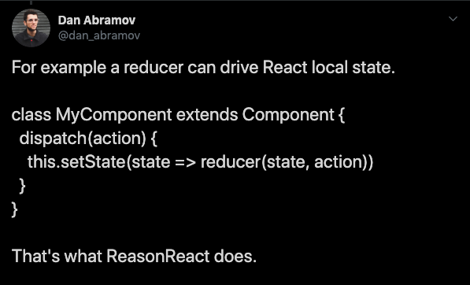

Anybody that has been using react for some time is probably aware of the big amount of solutions to manage state. It always depends on multiple factors, project, context, team, size of an app…

A few months ago, my team at KI labs was given the responsibility to start migrating a jQuery + server-side rendered app to a single page app.

We first created a PoC, to decide which technology should we go with. At the time it was Vue vs React.

I’ll probably also blog for the reasons, motivations, and methods we use to experiment and choose technologies that best fit clients and projects at KI labs.

# Managing state

The eternal discussion… Redux? Mobx? Context? People have preferences, but in the end, there are some solutions that are better suited to some projects.

By looking at the project needs, Redux seemed quite a bit of overhead. Even though it is a great library, global state was not a need. The same applies for Mobx. Regarding Context, we knew that we could end up using it in the future, probably not for state management, though.

Without the need to have global state, and with most of our state transitions being pretty simple, was there a need to add one more dependency to the project? Local state seemed enough…

# But we really liked how clean redux state transitions were…

All redux benefits seemed cool: The functional paradigm, testing state transitions, having them documented (actions) and being able to mock states for testing.

We recalled the following Dan Abramov tweet:



In the end, we opted for a hybrid approach, having local reducers with local dispatches (pretty much what useReducer does, now that hooks were launched)

useReducer hook makes this pattern a little more common and easy to use. But we had a few class components that we wanted to manage state this way, and hooks weren’t live, yet.

We established one rule, setState could only be called in a single place inside a component, the dispatch method. And we actually built one small util for that, createDispatch.

Basically, we just had a util function called createDispatch that was used to define the dispatch inside a class (would probably work well as a decorator).

```js
const createDispatch = reducer =>
  function(action) {
    this.setState(state => reducer(state, action))
  }
class ProductList extends React.Component {
  dispatch = createDispatch(reducer)
  constructor(props) {
    super(props)

    this.state = reducer()
  }
}
```

And now, all our state transitions just had to call `this.dispatch(toggleSidebarVisibility())`. We had reducer.js, as a file living along the component, as well as an actions.js file that defined all action types and action creators. (Example below)

```js
// reducer.js
const INITIAL_STATE = {
  topBar: {
    isVisible: true,
  },
}
const reducer = (state = INITIAL_STATE, action = {}) => {
  switch (action.type) {
    case TOGGLE_SIDEBAR_VISIBILITY:
      return {
        ...state,
        topBar: {
          ...state.topBar,
          isVisible: !state.topBar.isVisible,
        },
      }
    default:
      return state
  }
}
// actions.js
const TOGGLE_SIDEBAR_VISIBILITY = "TOGGLE_SIDEBAR_VISIBILITY"
const toggleSidebarVisibility = () => ({ type: TOGGLE_SIDEBAR_VISIBILITY })
```

Reducer has its own tests, granting that all state transitions are tested and work, that being one of reducer pattern’s great advantages.

```js
// reducer.test.js
it("toggles sidebar visibility", () => {
  let state = reducer(undefined, toggleSidebarVisibility())
  expect(state.topBar.isVisible).toBeFalsy()

  state = reducer(state, toggleSidebarVisibility())
  expect(state.topBar.isVisible).toBeTruthy()
})

```

____


# Best of both worlds

By applying this hybrid solution we get to pick and choose the best of both worlds. Although now we have a solution that is a bit more verbose, we also have a very decoupled and testable state transitions, which seems like a pretty reasonable tradeoff.

Using the reducers pattern with local state in such a decoupled structure it enables an easy transition into redux (upon the need to support global shared state), as it’s a matter of lifting the needed state (literally copy & paste) and everything else will still be working as expected.

What do you think of this approach? What do you normally use to manage state? Do you normally use setState? I would love to know.

At KI labs we’re very focused on using technology to help businesses solve problems, choosing the best tools for the job and making sure we’re helping companies and people thrive. We are faced with technical and business challenges on a daily basis, the same challenges we solve through creativity and innovation by our full-fledged team of people with different experiences, interests, and backgrounds.

Good news is that we are hiring top talent for our brand new office in Lisbon, if you want to work on a team with high standards and deliver top quality work on several projects, feel free to reach out!

Thank you for reading, I would love to hear your questions and feedback, feel free to DM or email me!
